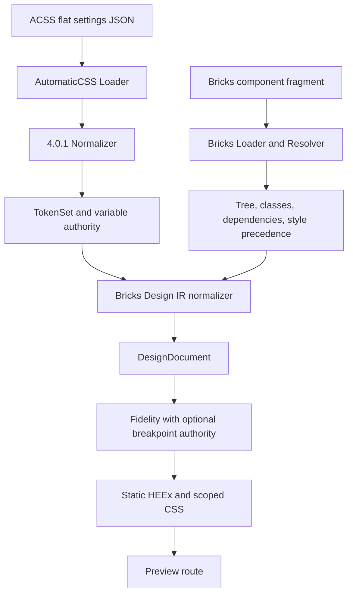
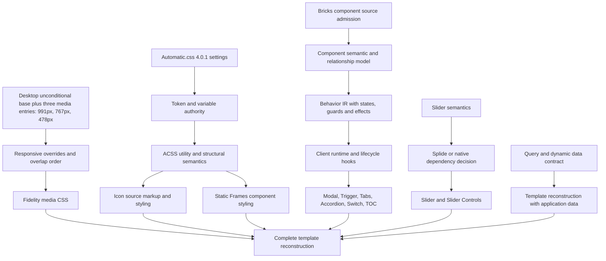

# C-07X unsupported Frames and ACSS capability inventory

## Audit result

This document records capabilities found in the supplied Frames exports, the extracted Frames component source, Automatic.css 4.0.1 SCSS, its generated DanBricks CSS, and the current LiveFrames pipeline. It does not copy implementation source or change production code.

The clearest gaps are the missing `mobile_landscape` 767px media-query entry, the lack of ACSS icon class and attribute semantics in Fidelity, and the missing path from Frames source behavior into the LiveFrames runtime. Existing source intake, token authority, responsive IR, two of the three media-query entries, and safe static CSS generation provide partial foundations.

## Baseline identity

| Item | Value |
| --- | --- |
| Protected branch | main |
| Base commit | d8f8c718f718713d37a4cc4f64e62f73225cdbf8 |
| Base tree | 0751569760599e3bedd7dd4e41e7318887bbe43e |
| Audit branch | docs/c07x-unsupported-surface-inventory |
| Worktree at audit start | Clean |

The baseline was fetched and checked before source inspection. The audit branch was created from that exact commit.

## Authority-source inventory and digests

Each tree digest uses records sorted lexicographically by relative path. A record is relative path, tab, byte size, tab, lowercase SHA-256, newline. The digest is SHA-256 of the concatenated records. Each source set has its own digest.

| Authority | Version or scope | Records | Digest |
| --- | --- | ---: | --- |
| Frames exported corpus | staging-2026-09; archives excluded | 34 | 074b60cf0ca2db30babe956a657d4838963bcb3a9c69a1eef70d888d93f31d1e |
| Extracted Frames components | all regular files in frames-components, including bundled third-party files | 43 | 630332dcedf3807064affcbe22cfed9d16859fdd771b815a8b06d4960774de9e |
| Extracted ACSS icon framework | all regular files in acss-icons | 5 | f196729484d67241ea3dc1ce066f24062a25677104907219d5660ba2654704f0 |
| Automatic.css SCSS source | all regular files below assets/scss | 382 | 126e06db19f3e5efe04ce1e3f32e694107cd90813b40975ffbab8dddb3f1e831 |
| Generated DanBricks CSS | all regular .css files below uploads/automatic-css | 10 | 7706596fc43697da65a64e03f473b9341efe1fc239c27f7dda14469f3abf9e42 |

The installed plugin identifies itself as Automatic.css 4.0.1 in `wp-content/plugins/automatic-css/automatic-css.php:12`. The SCSS digest therefore describes the required version-specific authority. The generated CSS digest describes the effective configured project output, not the SCSS generation rules.

The 34-record Frames digest matches the supplied canonical contract. Its archive record is excluded. The component corpus and icon framework remain separate authority sets and do not alter that digest. The extracted icon files correspond by content to the versioned icon files under assets/scss/modules/icons.

### ACSS icon file hashes

| Extracted file | SHA-256 |
| --- | --- |
| icons/_vars.scss | 375d56c26907e69c92f57b5f6360c569c4a06d56455b0be33d05453fcdff030c |
| icons/_tokens.scss | ae4a1c254b4e83f2133f785c13ce2a023dcb62418034eaa7e0c2880b3291631c |
| icons/_classes.scss | 838ed7a5aca2621f0316921b3b6fc00d69bb057d8f8a612eec5a44bdcbe7f9ce |
| icons/_mixins.scss | 725b774193773880d31fd420d0f22520013b9c721de90162a65db70fd9dd9029 |
| icons/_cheatsheet.json | ac23548b037c1d0bec08ea2e32added572d3b3d41188e612bb3a6310d28519f6 |

### Effective generated CSS checked

The ten output files are `automatic.css`, `automatic-tokens.css`, `automatic-variables.css`, `automatic-bricks.css`, `automatic-bricks-in-builder.css`, `automatic-custom-css.css`, `automatic-core-for-block-editor.css`, `automatic-core-for-iframe-editor.css`, `automatic-gutenberg.css` and `automatic-gutenberg-color-palette.css`. The frontend icon rules are in `automatic.css`. `automatic-bricks.css` is empty; the builder CSS has no icon framework rules. The generated CSS digest above records this snapshot separately from SCSS.

The supplied export corpus is not listed in REFERENCE_MANIFEST.md. Its identity is established here by the user-provided canonical count and digest. This is a repository indexing gap, not a digest mismatch.

## Frames export evidence

The exported corpus has nine Bricks component fragments, one ACSS settings object, and 24 PNG captures. The fragments use the Bricks 2.3.1 component format, with top-level components and globalClasses. They contain 454 elements and 151 global class records. The captures show named static states and viewport examples; they do not establish behavior between those states.

| Export | Evidence found |
| --- | --- |
| CTA Tango | Image composition, headings, rich text, primary button, grids and tablet variable changes. |
| Feature Milan | Dynamic feature data, tab-like ARIA markup, separate desktop and mobile media groups, and an embedded interval script that rotates the active feature. |
| Feature Romeo | Four linked cards, hover and focus-within styles, Bricks mouseenter/mouseleave interactions, and a mobile column layout. |
| Gallery Bravo | Attachment query, random order, lightbox link settings, result count, responsive grid and expanded lightbox capture. |
| Header Basel | Nested mobile navigation, dynamic logo, query-based menu items, dropdowns, trigger widget, and an embedded resize/load/mutation script. |
| Hero Barcelona | Headings and calls to action, three decorative query-based slider columns, aria-hidden duplicate wrappers, motion and responsive layout. |
| Pricing Echo | Frames tabs, monthly/yearly pricing panels, repeated feature rows, icon content, accordion-on-device settings, and responsive card grids. |
| Slide Menu Alpha | Navigation landmark, native details/summary groups, current-page link behavior, CSS disclosure transitions and reduced-motion rules. |
| Slider Basel | Frames slider with loop, arrows, play/pause controls, one slide per page, a query source, active/inactive slide styling and mobile layout. |

The ACSS export contains 2,573 flat setting keys, including 241 option keys. It records viewport limits, fluid spacing and typography inputs, colors, button and card settings, reduced motion, smooth scrolling, scheme settings, and Frames widget gates. These settings prove configuration values. They do not prove that LiveFrames emits the associated CSS.

The Bricks fragments include source names such as fr-slider, fr-tabs, fr-trigger, fr-notes, nav-nested, dropdown, svg, and code. They also carry query-loop settings, dynamic values, custom CSS, interactions, accessibility attributes and scripts. Some source attributes are static. Others name runtime behavior. The export does not establish the active browser behavior, cleanup, generated widget DOM, complete keyboard support, focus order, or live announcements.

Relevant examples include feature tabs without an exported aria-controls relationship, duplicated Hero content marked aria-hidden and tabindex -1, dynamic image values with no source alt text, and screenshots that show a lightbox or menu state without proving the key or focus paths to reach it.

## Current LiveFrames pipeline

Source paths in this section are relative to `apps/live_frames/lib/live_frames/` unless they begin with a repository path.

The AutomaticCSS adapter at `apps/live_frames/lib/live_frames/adapters/automatic_css.ex:67` accepts flat settings JSON and normalizes a supported subset of 4.0.1 settings into a TokenSet. The normalizer and resolver provide path-based token mappings (`automatic_css/normalizer.ex:57-414`, `automatic_css/resolver.ex`). The adapter does not load ACSS SCSS, generated project CSS, icon assets, or an ACSS browser runtime. Source version metadata is supplied by the caller or a fixture, not embedded in every settings export.

The Bricks loader at `adapters/bricks/loader.ex:65` recognizes copied-element envelopes and component fragments. Stage A has a smaller element set and rejects component fragments (`adapters/bricks/stage_a.ex:255-292`). The Design IR path accepts component fragments, resolves class records, extracts style and runtime dependencies (`design_ir_normalizer.ex:95-106, 296, 489`; `dependency_extractor.ex:1183`), applies property precedence (`style_precedence.ex:66`), and maps a limited set of Bricks elements into semantic nodes. Unknown custom elements survive as unsupported nodes with diagnostics. Source class names remain trace data unless a resolver maps their meaning.

The Design IR supports generic section, container, heading, text, image, button and link semantics; source traces; token references; attributes; responsive overrides; assets; and a generic interaction registry. The Bricks normalizer currently creates empty interaction references and an empty interaction registry (`design_ir_normalizer.ex:296, 489`). It does not turn Frames widget controls into component semantics or behavior records. Responsive source labels remain unresolved in normalization when numeric breakpoint authority is absent (`settings.ex:671, 747`; `design_ir_normalizer.ex:1247`).

Fidelity renders static HEEx and CSS. Its AutomaticCSS resolver has a small class set, including bg--ultra-dark, btn--primary and btn--outline, plus semantic section and heading rules. The serializer has no `StyleValue` branch for `:responsive` (`fidelity.ex:452`); separate `ResponsiveOverride` records can resolve with accepted authority (`fidelity.ex:584`) and are grouped in authority order (`fidelity.ex:1202`). Fidelity does not load the project's generated ACSS CSS or implement the icon framework. The preview renders generated output (`apps/live_frames_preview/lib/live_frames_preview_web/live/fidelity_preview_live.ex`); its JavaScript only opens LiveSocket (`apps/live_frames_preview/assets/js/app.js:5`) and does not attach Frames behavior hooks.

## Classification model

The matrix uses the required layer codes:

| Code | Meaning |
| --- | --- |
| A | Source admission is missing |
| B | Semantic normalization is missing |
| C | Required authority is missing |
| D | Design IR representation is missing |
| E | Fidelity or CSS serialization is missing |
| F | Runtime behavior is missing |
| G | An external dependency choice remains open |
| H | Supported at the stated scope |
| I | Partially supported |
| J | Available evidence cannot establish the claim |

Each matrix row represents one capability. H, I and Unsupported are counted as mutually exclusive outcomes through the full pipeline. A row may also carry a layer code such as C or F. N/A means the layer does not apply, for example browser runtime for a pure CSS utility.

Blocked is a dependency note, not a new layer code. The dependency column identifies leaves whose work waits on a missing foundation. Responsive mobile_landscape output waits on C-07B3 authority; Slider Controls wait on the Slider runtime; interactive Frames components wait on the shared behavior and client runtime contracts; full template reconstruction waits on those capabilities and the query/data contract.

## Unsupported capability matrix

### Responsive capabilities

| ID | Capability | Evidence | Parse | Normalize | Authority | IR | Fidelity | Runtime | Classification and outcome | Dependency |
| --- | --- | --- | --- | --- | --- | --- | --- | --- | --- | --- |
| R01 | Desktop/base styles, no media query | Base Bricks declarations are emitted as unconditional CSS. | H | H | N/A | H | H | N/A | H, supported | None |
| R02 | tablet_portrait, max-width 991px | Accepted authority and Fidelity tests emit max-width 991px. | H | H | H | H | H | N/A | H for this supplied entry | Breakpoint authority input |
| R03 | mobile_landscape, max-width 767px | Export names exist and task authority supplies 767px; committed breakpoint authority has no entry. | H | H | C | I | C | N/A | I, partial | C-07B3 mobile_landscape media entry |
| R04 | mobile_portrait, max-width 478px | Accepted authority and Fidelity tests emit max-width 478px. | H | H | H | H | H | N/A | H for this supplied entry | Breakpoint authority input |
| R05 | Responsive declaration precedence | Settings precedence resolves class and element declarations per property at the same breakpoint. | H | H | N/A | H | H | N/A | H for same-breakpoint precedence | StylePrecedence |
| R06 | Overlapping max-width semantics and cascade | Current 991px and 478px rules overlap and serialize in authority order. The full 991/767/478 chain lacks the 767 authority entry. | H | I | I | I | I | N/A | I, partial | C-07B3 and accepted source ordering |
| R07 | ResponsiveOverride representation | IR retains source name, style map and unresolved thresholds without inventing widths. | H | H | I | H | I | N/A | I, partial | Breakpoint authority for emission |
| R08 | StyleValue kind `responsive` | The kind validates in IR, but Bricks uses ResponsiveOverride and Fidelity has no serializer branch for this kind. | H | B | N/A | H | E | N/A | Unsupported | StyleValue contract decision |
| R09 | Fidelity media-query serialization | Fidelity validates supplied max/min semantics, groups output and orders media blocks by authority cascade order. | H | H | H | H | H | N/A | H when authority is supplied | BreakpointAuthority |

| Source responsive context | Representation | Current state |
| --- | --- | --- |
| desktop | Unconditional base CSS; no `BreakpointAuthority.Entry` | Cascade metadata names it as the base. |
| tablet_portrait | `max-width: 991px` media entry | Present in `BreakpointAuthority.breakpoints`. |
| mobile_landscape | `max-width: 767px` media entry | Listed in cascade source order; numeric entry is missing. |
| mobile_portrait | `max-width: 478px` media entry | Present in `BreakpointAuthority.breakpoints`. |

The local `BreakpointAuthority` therefore has two of the three required media-query entries. Its validator requires a supported query semantic and a matching media condition (`apps/live_frames/lib/live_frames/responsive/breakpoint_authority.ex:201-262`), so desktop must remain outside the media-entry map. Fidelity preserves separate max-width conditions instead of converting them into disjoint ranges. At widths at or below 478px, all three rules will match once C-07B3 adds the missing entry; the later authority order must let the mobile portrait declaration win for the same property. The relevant checks are `apps/live_frames/test/live_frames/responsive/breakpoint_authority_test.exs` and `fidelity_responsive_test.exs`.

### ACSS icon capabilities

| ID | Capability | Evidence | Parse | Normalize | Authority | IR | Fidelity | Runtime | Classification and outcome | Dependency |
| --- | --- | --- | --- | --- | --- | --- | --- | --- | --- | --- |
| I01 | Icon framework enablement | ACSS source and generated CSS prove option-icons is on. LiveFrames does not map that gate to icon behavior. | H | B | C | D | E | N/A | B/C/D/E, Unsupported | ACSS option model |
| I02 | data-icon | Generic data attributes are allowed on supported Bricks nodes and can be emitted. No icon selector CSS is emitted by LiveFrames. | H | B | C | I | E | N/A | I, partial | Icon CSS authority |
| I03 | data-icon-size and data-icon-style | Static attribute values can be preserved, but their icon style meaning is not normalized. | H | B | C | I | E | N/A | I, partial | Icon CSS authority |
| I04 | .icon--boxed and .icon--plain | ACSS compiles both utilities; Fidelity does not preserve or resolve these class rules. | H | B | C | D | E | N/A | B/C/D/E, Unsupported | Utility class mapping |
| I05 | .icon--xs, .icon--s, .icon--m, .icon--l and .icon--xl | Generated selectors and configured size variables exist. LiveFrames has no icon utility mapping. | H | B | C | D | E | N/A | B/C/D/E, Unsupported | Icon variable authority |
| I06 | .icon--2xl and data-icon-size=2xl | Selector exists in generated CSS but --icon-size-2xl and --icon-padding-2xl are absent. The reason is not established. | H | B | J | D | E | N/A | B/C/D/E/J, Unsupported and evidence gap | ACSS value evidence |
| I07 | .icon-list and data-icon-list | Class CSS defines list layout. The data-icon-list attribute is explicitly outside the current static attribute allowlist. | I | B | C | D | E | N/A | A/B/C/D/E, Unsupported | Attribute policy and list CSS |
| I08 | SVG icon markup | The source supports SVG selectors and nested SVG color rules; LiveFrames has no SVG icon source element or SVG serializer. | A | B | C | D | E | N/A | A/B/C/D/E, Unsupported | Icon asset and markup contract |
| I09 | i element icon-font markup | ACSS emits an i::before rule, but i is not an allowed static native tag in LiveFrames. | A | B | C | D | E | N/A | A/B/C/D/E, Unsupported | Native tag policy and font source |
| I10 | .brxe-icon | The source has an override gated by a Bricks option. The configured generated output contains no brxe-icon rule. LiveFrames has no corresponding element mapping. | A | B | C | D | E | N/A | A/B/C/D/E, Unsupported for this project output | Bricks option and icon mapping |
| I11 | Icon color and hover color | ACSS defines color variables, SVG propagation and hover selectors. LiveFrames has no icon selector generation. | H | B | C | D | E | N/A | B/C/D/E, Unsupported | Color and selector authority |
| I12 | Icon background and hover background | ACSS styles boxed backgrounds and link hover variables; the active default style is plain. No corresponding LiveFrames CSS exists. | H | B | C | D | E | N/A | B/C/D/E, Unsupported | Background and selector authority |
| I13 | Icon border, padding, radius and shadow | Boxed mixin defines border, padding, radius and background. Base shadow uses a none fallback in the effective output. | H | B | C | D | E | N/A | B/C/D/E, Unsupported | Icon variable authority |
| I14 | Icon scheme and size variables | ACSS emits --icon-* and size variables. These are CSS custom properties, not existing semantic token paths in LiveFrames. | H | B | C | D | E | N/A | B/C/D/E, Unsupported | Token mapping decision |
| I15 | Icon list layout | ACSS emits flex list layout, child positioning and optional boxed list behavior; LiveFrames emits none of those selectors. | H | B | C | D | E | N/A | B/C/D/E, Unsupported | Utility and structural recipe mapping |

### Frames component capabilities

Each row describes whether the named Frames component works through the full pipeline. The Bricks loader can parse the containing JSON, but custom Frames elements do not normalize into their own semantic nodes or behavior records. Static child elements and CSS values may survive independently.

| ID | Capability | Evidence | Parse | Normalize | Authority | IR | Fidelity | Runtime | Classification and outcome | Dependency |
| --- | --- | --- | --- | --- | --- | --- | --- | --- | --- | --- |
| F01 | Modal and trigger/action contracts | modal.php, modal.js, modal.css, ModalBuilderView.php | H | B | C | D | E | F | B/C/D/E/F/G, Unsupported | Browser state and media choices |
| F02 | Trigger button and target toggling | trigger.php, trigger.js, trigger.css | H | B | C | D | E | F | B/C/D/E/F, Unsupported | Component behavior contract |
| F03 | Slider and synchronized slider behavior | slider.php, slider.js, slider.css, bundled Splide files | H | B | C | D | E | F | B/C/D/E/F/G, Unsupported | Splide and auto-scroll decision |
| F04 | Slider Controls bound by sync ID | slider-controls.php and slider.js; slider-controls.js is empty | H | B | C | D | E | F | B/C/D/E/F, Unsupported | F03 slider runtime |
| F05 | Tabs and responsive accordion mode | tabs.php, tabs.js, tabs.css, TabsBuilderView.php | H | B | C | D | E | F | B/C/D/E/F, Unsupported | Component behavior contract |
| F06 | Accordion expansion, hash and keyboard behavior | accordion.php, accordion.js, accordion-new.js, accordion.css | H | B | C | D | E | F | B/C/D/E/F/J, Unsupported and evidence gap | New/legacy flag selection |
| F07 | Color Scheme toggle and icon morph | color-scheme.php, color-scheme.js, color-scheme.css | H | B | C | D | E | F | B/C/D/E/F/G, Unsupported | Flubber and ACSS scheme behavior |
| F08 | Table of Contents generation and active heading | table-of-contents.php, both JS bundles, CSS and Views | H | B | C | D | E | F | B/C/D/E/F/J, Unsupported and evidence gap | New/legacy flag selection |
| F09 | Switch presentation and content selection | switch.php, switch.js, switch.css | H | B | C | D | E | F | B/C/D/E/F, Unsupported | Component behavior contract |
| F10 | Notes builder annotation | notes.php, notes-new.js, notes.css | H | B | N/A | D | E | F for builder only | B/D/E/F, Unsupported in the LiveFrames preview | Bricks editor runtime |

### Cross-cutting capabilities

| ID | Capability | Evidence | Parse | Normalize | Authority | IR | Fidelity | Runtime | Classification and outcome | Dependency |
| --- | --- | --- | --- | --- | --- | --- | --- | --- | --- | --- |
| X01 | Frames component fragment admission | Design IR loader accepts component fragments; Stage A rejects them. Unknown widget names remain unsupported nodes. | I | I | N/A | I | I | N/A | I, partial | Bricks adapter route |
| X02 | Native structure and static style normalization | Selected Bricks nodes, style settings, class precedence and safe static attributes are represented; many export elements and generated class recipes are not. | H | I | I | I | I | N/A | I, partial | Bricks settings and style authority |
| X03 | ACSS settings and variable authority | TokenSet maps a supported 4.0.1 subset; structural authority resolves proven values including --grid-1. It does not model the complete generated CSS. | H | I | I | I | I | N/A | I, partial | ACSS version and variable mapping |
| X04 | Full ACSS class and selector generation | LiveFrames does not parse SCSS or import generated project CSS. Fidelity maps a small resolver set and emits only the mapped rules. | A | B | C | D | E | N/A | A/B/C/D/E, Unsupported | ACSS semantic contract |
| X05 | Generic interaction records | IR can store and validate interaction intent and target references; the Bricks normalizer creates no interaction records. | I | B | N/A | I | E | F | B/E/F, I at schema level but unsupported through the full pipeline | Behavior adapter |
| X06 | Behavior state, guard and effect representation | Current IR has no component state machine, keyboard transition, focus action, cleanup or event effect contract. | H | B | C | D | E | F | B/C/D/E/F, Unsupported | Behavior IR design |
| X07 | Runtime hook and lifecycle integration | Preview JavaScript connects LiveSocket only. It has no Frames component hooks or corresponding cleanup lifecycle. | H | B | N/A | D | E | F | D/E/F, Unsupported | Client runtime contract |
| X08 | Query loops and dynamic data | Dependency extraction records runtime and query evidence with diagnostics; it does not resolve source queries into application data. | H | I | C | D | E | F | C/D/E/F, I for evidence preservation | Data source and query contract |
| X09 | Static accessibility attributes and interactive relationships | A restricted static attribute set can reach markup. Dynamic aria-expanded, aria-selected, focus order, role relationships and state updates are not generated. | H | I | N/A | I | I | F | I/F, partial | Accessibility and behavior contract |
| X10 | Full exported template reconstruction | The nine fragments contain widgets, custom classes, queries, dynamic content, scripts and responsive changes beyond the current pipeline. | I | I | C | D | E | F | C/D/E/F, Unsupported | All foundational gaps |

The matrix contains 44 capability rows. Five are supported at the stated scope, 11 are partial, and 28 are unsupported through the pipeline. One row also records the unresolved reason for the missing 2xl icon variables. The eight numbered evidence limits are listed below.

## Broader Automatic.css SCSS and generated output

The SCSS tree is the authority for feature meaning and generation gates. The generated CSS is the effective DanBricks result. SCSS contains modules and branches that this project has disabled. Generated CSS shows which rules and values the current settings emitted. Paths under `modules/` and `platforms/` below are relative to the installed `assets/scss/` root. Line references to `automatic.css` refer to the generated `uploads/automatic-css/automatic.css`.

`automatic-imports.scss` loads the shared variable, map, mixin and module sources. `modules/_tokens.scss` defines root token import order; `automatic.scss` includes tokens, defaults, buttons, cards, icons, utilities, content grid and smart spacing. `automatic-tokens.scss` emits only tokens when `option-inline-tokens` is on; it is off here and the generated `automatic-tokens.css` is empty. `automatic-variables.scss` emits root variables only; its generated file has 511 lines and no utility selectors. Module layer options choose whether emitted CSS is wrapped in `@layer`; they do not gate module CSS emission. No `@layer` blocks appear in the configured `automatic.css`. `platforms/bricks/automatic-bricks.scss` imports shared sources, but the current generated `automatic-bricks.css` is empty.

| SCSS family and source contract | Effective DanBricks output | Current LiveFrames boundary |
| --- | --- | --- |
| Palette, color scheme and contextual colors: palette maps and merge gates (`modules/palette/_color-merge.scss:28-107`); scheme selectors (`modules/color-scheme/_output.scss:3-25`); contextual variables and selectors (`modules/contextual-colors/*`, `modules/color-relationships/*`). | Root palette and contextual variables, background/text utilities, and scheme relationship selectors are present (`automatic.css:6-61, 363-393, 1115-1266`). The project uses auto color scheme and `website-color-scheme="light only"`; some secondary, accent and status branches are disabled. | Token normalization covers 27 color paths (`automatic_css/normalizer.ex:57-136`); Fidelity resolves `bg--ultra-dark` only, including related text and heading colors (`fidelity_resolver.ex:60-66`). Other contextual utilities and relationships lack resolver support. |
| Spacing and gaps: fluid maps and token emission (`modules/spacing/_maps.scss:1-53`, `_tokens.scss:1-32`), named gaps, automatic gaps and smart spacing (`modules/spacing/gap/*`, `modules/spacing/smart-spacing/*`). | Fluid space and section variables, section utilities, automatic gaps and smart-spacing selectors are emitted (`automatic.css:151-204, 1267-1355, 1536-1548, 1700-1778`). Named gap classes are gated off; automatic container/content/grid gaps are on. | Normalization covers 16 spacing/radius paths (`normalizer.ex:138-246`). Fidelity applies section padding, gutter and container gap for semantic sections (`fidelity_resolver.ex:36-46`); it does not resolve section utility, smart-spacing or named gap class meaning. |
| Typography: fluid scale generation, defaults, heading and text utility selectors (`modules/text/*`, `modules/defaults/*`). | Fluid text/heading clamps and body/heading defaults are emitted; text-size classes are on, while basic weight/style/alignment/decoration/transform classes are off (`automatic.css:98-145, 548-605, 1396-1459`). | Normalization covers nine typography paths (`normalizer.ex:248-307`); Fidelity handles heading tags and their mapped properties (`fidelity_resolver.ex:36-56`). Text utility classes do not resolve. |
| Grids and layout: traditional and auto-grid variables, auto-grid mixin, content-grid recipe, and variable-grid output (`modules/grid/traditional-grid/*`, `auto-grid/*`, `content-grid/*`, `variable-grid/*`). | Grid and auto-grid variables plus content-grid placement are emitted (`automatic.css:218-252, 1659-1697`). The project enables grid and auto-grid variables and content grid; content-grid section classes, traditional grid classes, variable grids, flex grids and columns are gated off. | Structural authority records only `--grid-1` (`structural_variables.ex:11-47`), and exact direct grid-template values can resolve (`docs/07_BRICKS_ADAPTER.md:170-194`). `--grid-2` through `--grid-12`, auto-grid formulas, named content-grid lines and layout recipes have no authority record or Fidelity resolver. |
| Buttons: property maps, reusable physical recipe, hover/focus states and size/style selectors (`modules/buttons/_button-mixins.scss:7-77, 111-130`; `_buttons.scss:1-7`). | Primary and neutral families plus generic physical, hover, focus and size rules are emitted (`automatic.css:655-801`). Secondary and status selector families are absent in this project output. | Normalization covers 21 primary-button paths (`normalizer.ex:309-414`). Fidelity resolves `btn--primary` and `btn--outline` (`fidelity_resolver.ex:68-102`); neutral, status, size and other class behavior are absent. |
| Cards: custom properties and a nested card recipe for layout, padding, gap, border, radius, background, media, text and controls (`modules/cards/_vars.scss:1-99`, `_mixins.scss:1-111`, `_classes.scss:1-10`). | Card variables and `.card` flex recipe are emitted (`automatic.css:312-348, 802-875`). Boxed card icons and concentric radius are off; several card icon overrides remain. | No card token mapping, structural authority or card resolver branch exists. |
| Icons: attributes, SVG/i selectors, style and size classes, hover, list recipe and scheme inheritance (`modules/icons/_vars.scss`, `_tokens.scss`, `_mixins.scss`, `_classes.scss`). | The output contains root icon values, class/attribute selectors and contextual scheme selectors (`automatic.css:432-457, 876-989, 1255-1266`). See the dedicated ACSS icon analysis below for effective option gates and missing 2xl values. | No icon token mapping, element normalizer path or Fidelity resolver exists; the generic `icon` DesignNode type alone does not create a complete icon path. |
| Accessibility, focus and motion: hidden-accessible and skip-link rules, selection styling, focus mixins, reduced-motion rules, transitions and effects (`modules/accessibility/*`, `modules/focus/*`, `modules/transition/*`, `modules/effects/*`). | Focus tokens and `:focus-visible`, `.hidden-accessible`, `.skip-link`, smooth-scroll, global reduced-motion rules, transition values and effect fallbacks are emitted (`automatic.css:68-72, 994-1099, 1552-1630`). `option-accessibility-classes`, `option-focus-styles`, `option-reduce-motion`, `option-smooth-scrolling` and `option-transition-variables` are on; transition classes are off. Individual hover, enter, exit and visible effects are off. | Some static accessibility attributes survive on supported nodes, but ACSS focus, reduced-motion, effect and transition selector meaning has no general class resolver. Interactive ARIA state and focus actions also need the missing behavior pipeline. |
| Borders, shadows, width, overlays and background positioning: token/class sources in `modules/borders/*`, `modules/shadows/*`, `modules/width/*`, `modules/overlays/*` and `modules/is-bg/*`. | Border/radius values, shadow presets, width utilities, generic overlay and `.is-bg` positioning are emitted (`automatic.css:394-412, 459-475, 1380-1395, 1466-1535, 1549-1550, 1631-1658`). Border/radius utility classes and radius sizes are gated off. | These class families have no mapped token authority or Fidelity resolver support. Existing style properties can still be represented when admitted from Bricks settings, but that does not implement ACSS class recipes. |

This family map supplies source and generated CSS evidence for matrix rows X03 and X04. It does not add rows to the 44 capability count.

Effect output has an option-dependent edge case. The individual hover, enter, exit and visible class declarations are gated off in this project. Shared `on-enter-all` and `on-exit-all` child shells, the visible stagger rule, unsupported-browser resets, and reduced-motion resets remain in `automatic.css:1565-1630`. The child shells reference keyframes whose generating options are off. The output does not establish a working entrance or exit effect for this configuration.

ACSS calculates its fluid variables during Sass generation. `fluidClamp` use in the spacing maps and text mixins becomes CSS `clamp()` values in `automatic.css`; the browser evaluates the CSS result. LiveFrames represents the inspected fluid spacing relationships and typography clamps with `FluidClamp`, but its adapter documentation does not claim full ACSS responsive or utility support (`docs/06_ACSS_TOKEN_ADAPTER.md:500-511`). Named Bricks media breakpoints are a separate source authority problem, covered in the responsive matrix.

The current adapter documentation lists 76 canonical token paths across color, spacing/radius, typography, primary buttons and viewport settings (`docs/06_ACSS_TOKEN_ADAPTER.md:205-359`). It does not represent all generated classes and selectors. SCSS establishes what may be generated under options; this audit does not infer browser-computed style for arbitrary markup or claim that every available class occurs in the site.

## ACSS icon analysis

The icon framework is a Sass-generated, pure CSS feature. It combines custom properties, selectors, utilities, attribute selectors and structural mixins. It does not require a browser JavaScript runtime in the inspected icon source.

### Gates and effective configuration

The icon token and class modules run when option-icons is on. The current DanBricks setting is on. Icon class layer wrapping is separately controlled by the layer option; that option is off, so the configured output has no icon layer wrapper. The boxed-list icon option is off. The Bricks override is gated separately and the generated output has no .brxe-icon rule.

The source has a compile-time option-boxed-list-icons branch. The icon cheatsheet also refers to option-expand-icon-sizes, but no matching Sass variable or exported setting establishes a working gate for it.

### Attribute and class behavior

The framework selectors include [data-icon] on svg, i and a; nested SVG color propagation; i::before for icon fonts; data-icon-size and data-icon-style; boxed and plain styles; and both data-icon-list and .icon-list. Hover selectors cover icon links, ancestor links, data-icon-hover and direct icon children of links or buttons.

The base icon recipe centers icons with flex layout, prevents shrinking, sets content-box sizing, color, font size, width, height, transition, shadow and overflow. The size utilities xs, s, m, l, xl and 2xl set width and height through size variables. Boxed styles add padding, border width/style/color, radius and background. Plain styles reset background, border width and padding. The list recipe controls flex layout, child position and list spacing.

These are utility-class and attribute semantics backed by pure CSS. The variables named --icon-color, --icon-size, --icon-padding, --icon-radius and list size/gap properties are CSS custom properties. This audit does not treat them as LiveFrames tokens because no matching token meaning or LiveFrames mapping currently exists.

### Generated output and project values

The current automatic.css contains icon variables at lines 432-458 and icon rules at lines 876-989. It also contains contextual scheme selectors at lines 1255-1266 and card icon rules at lines 851-858. The configured project supplies sizes 12px, 16px, 32px, 64px and 128px for xs through xl. It does not emit --icon-size-2xl or --icon-padding-2xl even though the 2xl selectors exist. The source shows null Sass values are omitted, but it does not prove which setting left those values null.

The effective root uses a default icon style of plain and sets --icon-scheme to inherit. The source mixin passes default as its fallback scheme value, so the emitted base declaration uses var(--icon-scheme, default). Base shadow falls back to none. Card boxed icon overrides are off in this project. The project has contextual scheme rules and card integration, but the corresponding LiveFrames CSS rules are not emitted.

### Icon source categories

| Category | Proven evidence |
| --- | --- |
| Token-like CSS variables | Base icon size/color/padding/radius/shadow, per-size values, list size/gap/offset, card values and contextual scheme values. |
| Structural recipes | icon and boxed-style mixins, list flex layout, card icon integration and contextual scheme inheritance. |
| Utility classes | icon--boxed, icon--plain, icon--xs, icon--s, icon--m, icon--l, icon--xl, icon--2xl and icon-list. |
| Attribute semantics | data-icon, data-icon-size, data-icon-style, data-icon-list and data-icon-hover. |
| Pure CSS behavior | hover, inherited custom properties, selector composition, pseudo-elements and optional style reset. |
| JavaScript behavior | None found in the icon framework source. |

LiveFrames can preserve some safe static data attributes on supported elements, but that does not normalize icon meaning or emit the framework's CSS. It rejects data-icon-list as reserved runtime markup. The static native tag allowlist excludes svg and i. The Bricks icon widget therefore has no supported markup-to-icon path, despite icon appearing in the generic DesignNode semantic type list.

## Frames component implementation inventory

The extracted implementation corpus contains ten requested component families plus shared builder Views. The records are behavior evidence only. No source PHP, JavaScript, CSS or bundled dependency is copied here.

### Shared builder Views

Views/Base.php depends on WordPress argument parsing and output buffering. ModalBuilderView, SliderBuilderView and TabsBuilderView emit editor scaffolds, not frontend option data or full accessibility state. TableOfContentsV2View serializes V2 options and uses Vue templates. Accordion and Notes define builder templates inside their element PHP files. Builder scaffolds do not establish frontend behavior; the Bricks runtime and component JavaScript supply that behavior.

### Modal

| Field | Evidence |
| --- | --- |
| Source files | modal/modal.php, modal/js/modal.js, modal/css/modal.css, Views/ModalBuilderView.php |
| Bricks contract | Nestable fr-modal. Controls cover selector/action triggers, repeat rules, display position, close controls, fade duration, body scrolling, media autoplay and breakpoint centering. |
| Child relationship | Modal contains overlay, body wrapper, nested Bricks children and optional close control. Selector triggers target its generated ID. Query-loop instances receive per-instance IDs. |
| ACSS primitives | Component CSS owns color, layout, spacing, visibility and body scroll lock. The modal state model needs no ACSS icon utility. |
| Frontend markup/data | fr-modal root, aria-hidden, trigger/action/repeat/scroll/close/position data, overlay, body and close button. |
| CSS responsibilities | Full viewport positioning, hidden/open/closing states, overlay, body offsets, close control and scroll lock. |
| Accessibility and keyboard | aria-hidden changes, selector role=button and tabindex, focus entry, focus trap, Escape close, optional return focus. Selector triggers have Enter but no explicit Space handler. |
| Responsive behavior | Trigger-relative placement recalculates on resize, orientation and scroll; it flips sides when space is short and can center below a configured threshold. |
| Builder behavior | ModalBuilderView emits an editor scaffold. A Bricks frontend check guards the normal runtime entry. Query builder code can retain one matching modal instance. |
| LiveFrames gap | No modal element semantics, focus manager, body lock, trigger relation, timers, media control or query-loop behavior reaches the current runtime. |

State machine:

- States: hidden, open, closing, invalid/no-op. Trigger-relative placement is a stable substate of open.
- hidden → open: click or Enter on a mapped trigger, or an enabled page-load, hover, mouse-leave or inactivity action. Guards require a target and modal body; repeat policy may consult local or session storage.
- open → closing: close control, custom selector, hamburger trigger, Escape or overlay click. Overlay closure is blocked by the disable-close-outside setting.
- closing → hidden: fade timeout expires. The source removes the closing state, restores body scroll and scroll position, stops media, resets trigger classes and returns focus after keyboard closure.
- Side effects: aria-hidden changes, display and CSS classes, focus capture/restore, focus trap, scroll lock, media playback, local/session storage, trigger state and placement updates on viewport events.
- Stable states: hidden and open. Invalid selectors, malformed option JSON or missing targets log or return without a completed transition. The builder scaffold does not prove the frontend state machine runs in the editor.

### Trigger

| Field | Evidence |
| --- | --- |
| Source files | trigger/trigger.php, trigger/js/trigger.js, trigger/css/trigger.css |
| Bricks contract | Non-nestable fr-trigger in burger or button mode. Controls choose a target, class to toggle, text/icons, active styling and accessible label. |
| Child relationship | No children. Optional selector points to a separate navigation or target element. |
| ACSS primitives | Component CSS defines burger transforms, flex and transition styling. No external ACSS runtime is required by its state transitions. |
| Frontend markup/data | Native button, aria-label, aria-controls="navigation", aria-expanded="false", data-fr-trigger-options and mode-specific child markup. |
| CSS responsibilities | Burger lines and transforms, active icon/text visibility, button layout and transition. No media query was found. |
| Accessibility and keyboard | Native button provides Space activation; JavaScript handles Enter. aria-expanded updates. The generated aria-controls value stays `navigation` regardless of configured target. |
| Responsive behavior | No component media query. |
| Builder behavior | There is no builder template or builder state machine. Asset enqueue and initialization require the Bricks frontend. |
| LiveFrames gap | Current static button output does not normalize target selectors, active text, state attributes or class toggles. |

State machine:

- States: idle/inactive, active, invalid target.
- idle ↔ active: click or Enter toggles the root active class, optional active text, configured target class and aria-expanded. A later activation reverses the same changes.
- Guard: no target class means the root state still changes while target mutation is skipped.
- Side effects: class mutation, text swap and ARIA mutation. No storage, timer or server update exists in this component.
- Invalid: malformed or missing target selectors log errors. A missing target leaves the button active state changed but does not change another element.
- Cleanup: no separate cleanup phase or listener removal is defined. The frontend guard excludes its runtime from the builder.

### Slider

| Field | Evidence |
| --- | --- |
| Source files | slider/slider.php, slider/js/slider.js, slider/css/slider.css, slider/css/splide.min.css, slider/js/splide.min.js and auto-scroll extension |
| Bricks contract | Nestable fr-slider. Controls cover slide count, focus, gap, direction, height, loop/fade, autoplay, auto-scroll, drag, wheel, arrows, pagination, progress, sync and labels. |
| Child relationship | Default structure creates three fr-slide children under Splide track/list wrappers. Sync groups connect multiple sliders and separate Slider Controls widgets by ID. |
| ACSS primitives | Slider CSS owns component styling. Bricks supplies breakpoint values for Splide options. |
| Frontend markup/data | Splide root/track/list classes, data-splide, breakout, sync, sync ID, auto-scroll and slide metadata. |
| CSS responsibilities | Track, controls, progress, overflow, vertical mode, transitions, active/inactive styling and builder pagination. Splide core CSS supplies layout. |
| Accessibility and keyboard | Runtime assigns list/slide roles and aria-controls, generates progress buttons and changes tabindex on hidden slides. Native Splide owns keyboard behavior not rewritten here. |
| Responsive behavior | PHP converts Bricks breakpoints into Splide options; vertical mode uses configured height. |
| Builder behavior | The builder disables autoplay, drag and pagination, uses noDrag for builder elements, and may emit static pagination. Builder View emits only a structural scaffold. |
| LiveFrames gap | No slider IR, synchronized state, active-slide accessibility updates or JS lifecycle exists. Splide and its extension need an explicit dependency choice. |

State machine:

- States: pre-mount markup, initializing, mounted at active index, special filter mode, invalid/no-op.
- pre-mount → initializing → mounted: frontend startup adds slide classes, groups sync IDs, creates Splide instances, mounts them and stores them in a Bricks global.
- Mounted index changes on Splide movement, arrows, progress buttons, drag, wheel, autoplay or auto-scroll. Matching sync groups issue the same movement to peers.
- Visible ↔ hidden slide: focusable descendants are set to tabindex -1 while hidden and restored when visible.
- Special filter mode removes pagination/list children and returns without normal mount. Content filters can rerun or refresh instances.
- Side effects: DOM class/ARIA/ID changes, global instance storage, focusability changes, image loading, generated progress buttons and sync events.
- Cleanup: the source restores tabindex values but repeated initialization can append duplicate progress buttons. Component destruction/listener cleanup is not established in the reviewed wrapper.
- Builder: autoplay, drag and pagination are disabled. The editor scaffold does not include the full frontend options.

### Slider Controls

| Field | Evidence |
| --- | --- |
| Source files | slider-controls/slider-controls.php, slider-controls/js/slider-controls.js, slider-controls/css/slider-controls.css; parent binding is in slider/js/slider.js |
| Bricks contract | Non-nestable next/previous, previous-only, next-only or progress widget with sync ID and labels. |
| Child relationship | Binds only to a mounted slider with matching sync ID. |
| ACSS primitives | The component CSS owns control styles. |
| Frontend markup/data | Native arrow buttons or progress markup; root carries sync ID and navigation type. |
| CSS responsibilities | Arrow layout, hit areas, progress bar and static builder progress width. |
| Accessibility and keyboard | Native button labels. Progress buttons receive generated labels and indexes from the parent slider runtime. |
| Responsive behavior | No separate responsive behavior is established in the inspected control CSS. |
| Builder behavior | The progress bar has a static preview; the controls script has no local behavior. |
| LiveFrames gap | There is no local runtime. The controls only operate through the missing Slider integration. The progress branch can be skipped when both arrow icons are absent. |

State machine:

- States: emitted/unbound, bound to matching slider, endpoint-disabled, invalid/no-op.
- emitted → bound: parent slider scans controls and matches sync ID after mount.
- Bound arrows call Splide go. Non-loop/non-rewind endpoints set the relevant native button disabled. Progress buttons update active index and progress width.
- Guards: a matching mounted slider group is required. Without it, controls remain inert.
- Side effects: parent changes slider index, button disabled state and progress markup. Slider Controls JavaScript is empty and defines no own transition or cleanup.
- Builder: progress preview with fixed width; no interactive control state is defined.

### Tabs

| Field | Evidence |
| --- | --- |
| Source files | tabs/tabs.php, tabs/js/tabs.js, tabs/css/tabs.css, Views/TabsBuilderView.php |
| Bricks contract | Nestable fr-tabs with active tab, orientation, animation, hash scrolling, content selector, accordion conversion, close-previous and style controls. |
| Child relationship | Navigation list and tab links are separate from tab content wrappers/items. Content can be moved to an external selector. |
| ACSS primitives | Component styles own tab and accordion presentation. Bricks breakpoint input controls conversion. |
| Frontend markup/data | Root data-fr-tabs-options; navigation/content nodes. JS creates IDs, roles and relationships. |
| CSS responsibilities | Active/hidden content, list direction, accordion mode, animated indicator and builder clones. |
| Accessibility and keyboard | JS wires tablist/tab/tabpanel, aria-controls/labelledby, aria-selected and tabindex. Left/right or up/down navigation depends on orientation and wraps. Home/End are absent. |
| Responsive behavior | At configured threshold, content is moved beside links in accordion mode; above threshold it is moved back. |
| Builder behavior | The View emits an editor scaffold. JavaScript contains helpers for cloned content, but a frontend check guards its main entry. |
| LiveFrames gap | No tab relationships, active state, keyboard navigation, hash integration, responsive DOM movement or cleanup contract is represented. |

State machine:

- States: initialized tab mode with active index i, accordion mode with active/open index state, invalid/no-op.
- Tab click → active tab. Horizontal Left/Right or vertical Up/Down moves focus and switches with wraparound. Invalid active indexes reset to zero.
- At or below configured breakpoint, tab mode → accordion mode and content moves after each link. Above it, content returns to its content wrapper.
- Hash click, initial hash or popstate activates a matching tab and scrolls with configured offset.
- Side effects: DOM movement/clones, active classes, aria-selected, tabindex, IDs/relationships, history updates, scroll and resize animation geometry.
- Invalid: missing external content wrapper can fail before querying children. The Enter handlers added as anonymous callbacks cannot be removed by constructing new anonymous callbacks, so the source can retain listeners after mode changes.
- Cleanup: responsive mode return restores nodes and removes builder clones; listener cleanup is incomplete.

### Accordion

| Field | Evidence |
| --- | --- |
| Source files | accordion/accordion.php, both JS files, accordion/css/accordion.css |
| Bricks contract | Nestable fr-accordion. Options include first/all open, close previous, hash, keyboard, FAQ data, duration, scroll and remove-at breakpoint. |
| Child relationship | Items require header and body; body contains content wrapper, header contains title and icon. |
| ACSS primitives | Component CSS owns layout and transitions; optional WP Grid Builder and Bricks filter integration reruns behavior. |
| Frontend markup/data | data-fr-accordion-options and generated header/body IDs and relationships. |
| CSS responsibilities | Collapsed/expanded height, header/body style, transition and static no-accordion presentation. |
| Accessibility and keyboard | aria-expanded, controls/labelledby, header role and tabindex, focusable descendant management. Enter/Space activate; Up/Down/Home/End move between headers when enabled. |
| Responsive behavior | removeAccordionAt switches to a static expanded presentation at a configured width; normal ARIA/listeners are skipped in that mode. |
| Builder behavior | The Vue template supplies toggle-all and first-item-open classes. The helper changes height and aria-expanded, but does not handle frontend hashes, focus or events. |
| LiveFrames gap | No item contract, ARIA transition, hash state, keyboard movement, FAQ output, custom events or responsive mode runtime exists. The active source bundle flag is external. |

State machine:

- States: collapsed items, expanded item set, static no-accordion, invalid structure.
- Click, Enter or Space toggles an item. With close-previous enabled, opening one item collapses the previous open item. Optional defaults expand the first or all items at startup.
- Up/Down/Home/End move focus when keyboard navigation is enabled. Hash load/click/popstate opens the target item, updates history and scrolls.
- At removeAccordionAt, the widget enters static no-accordion mode and skips normal role, ARIA and event setup.
- Side effects: aria-expanded, generated IDs and controls/labelledby, tabindex changes, body height, icon class, custom expand/collapse events, history, scroll, and optional FAQ JSON-LD.
- Invalid: malformed item shape is warned or rejected. Placeholders are removed; an empty widget may receive a placeholder item.
- Cleanup: collapse schedules height updates. Filter refresh clones headers to remove previous event state. The code has timeout cleanup behavior, but its flag-selected legacy/new bundle cannot be identified from this local source.

### Color Scheme

| Field | Evidence |
| --- | --- |
| Source files | color-scheme/color-scheme.php, color-scheme/js/color-scheme.js, color-scheme/css/color-scheme.css; bundled Flubber file |
| Bricks contract | Non-nestable simple icon-morph or toggle mode. Reads the ACSS website scheme. |
| Child relationship | None. Toggle mode contains checkbox, label, ball and optional icons/text. |
| ACSS primitives | Depends on ACSS scheme settings and external handling of data-acss-color-scheme. |
| Frontend markup/data | Simple button has aria-label, data-acss-color-scheme=toggle and SVG. Toggle emits checkbox and label structure. |
| CSS responsibilities | Checkbox/ball position, focus-within, labels, icon color and alternate scheme presentation. |
| Accessibility and keyboard | Toggle uses a keyboard-operable checkbox; simple mode uses a native button. Fixed checkbox ID can duplicate across instances. |
| Responsive behavior | No explicit responsive state was found. |
| Builder behavior | There is no separate builder template. Bricks frontend does not guard initialization. |
| LiveFrames gap | No theme-state authority, control markup, icon morph, persistence or external scheme update contract is present. |

State machine:

- States: simple mode light/alternate icon, morphing, toggle unchecked/checked, invalid/no-op.
- Simple click → morphing → opposite local icon state. During morphing, further clicks are ignored. Flubber interpolates SVG path data over animation frames.
- Checkbox change or text-label click toggles the checked class.
- Initial icon/checkbox state reads ACSS settings and the document scheme class. The component code does not itself update the document scheme class or data-acss-color-scheme behavior, so the full page color transition depends on external ACSS behavior.
- Side effects: SVG path updates, checkbox class/state, label class and requestAnimationFrame work. No listener cleanup or global scheme cleanup exists.
- Invalid: missing options logs and skips setup; JSON parsing has no local try/catch.
- Builder: same markup path; no distinct builder state machine.

### Table of Contents

| Field | Evidence |
| --- | --- |
| Source files | table-of-contents/table-of-contents.php, both JS bundles, CSS, Views/TableOfContentsView.php and TableOfContentsV2View.php |
| Bricks contract | Non-nestable TOC with heading selector, heading levels, accordion mode, offsets, active link styling and optional header selection. Legacy and V2 feature flag selects the view and script. |
| Child relationship | TOC builds a nested ordered list from page headings. It is not a parent of the content it indexes. |
| ACSS primitives | Component CSS owns counters, list and accordion layout. Reduced motion and optional fixed header behavior use browser and project settings. |
| Frontend markup/data | Legacy individual data attributes or V2 JSON options; nav, optional button, body, ordered list and placeholder link. |
| CSS responsibilities | List counters, nested list styles, accordion body, active/hover state, builder visibility. |
| Accessibility and keyboard | Nav aria-label and optional aria-expanded button. No controls/labelledby, tab roles or arrow-key behavior is defined. Native button keyboard activation applies in accordion mode. |
| Responsive behavior | No CSS breakpoint. Configured offsets and heading selectors are used at runtime. |
| Builder behavior | The V2 Vue template serializes settings and observes editor content. The legacy builder view is absent. An external feature flag selects the active version. |
| LiveFrames gap | No heading discovery, generated IDs, nested list, active heading, scroll offset, observer lifecycle or TOC state exists. |

State machine:

- States: shell/placeholder, initialized list, active heading link, accordion open/closed, waiting for content, invalid/no-op.
- Initialization removes placeholder, finds headings, generates heading IDs and builds nested list. Scroll updates active link. Link click scrolls using configured offsets and reduced-motion preference.
- Accordion button toggles body max-height, open class and aria-expanded.
- V2 content/options mutation disconnects and rebuilds its instance. Observers watch editor content and component changes; rebuild destroys old instance and disconnects its observers.
- Side effects: heading IDs, generated list DOM, active classes, scroll/history and MutationObserver registration. Legacy scroll handling uses scroll listeners.
- Invalid: missing shell, list, placeholder or selector can stop setup; V2 may refuse or fail to create an instance without headings. Invalid header selector falls back after logging in the V2 path.
- Builder: V2 editor observes its canvas; legacy builder output only exists under an external V2 flag.

### Switch

| Field | Evidence |
| --- | --- |
| Source files | switch/switch.php, switch/js/switch.js, switch/css/switch.css |
| Bricks contract | Non-nestable switch. Controls select a content wrapper and set default side, labels, accessible label, dimensions, colors and transitions. |
| Child relationship | Targets a separate wrapper with two direct content children. |
| ACSS primitives | Component CSS owns the indicator and content visibility styles. |
| Frontend markup/data | Native button, aria-label, type=button, data-fr-switch-options and indicator structure. |
| CSS responsibilities | Indicator movement, content visibility, transitions and builder warning. |
| Accessibility and keyboard | aria-pressed is set by JS. Native button handles Enter/Space; Left/Right also toggle. |
| Responsive behavior | No media query was found. |
| Builder behavior | Inline style helpers exist, but a frontend check guards the main initializer. There is no builder template. |
| LiveFrames gap | No two-content target model, selected side, aria-pressed transition or class synchronization exists. |

State machine:

- States: active child 1, active child 2, invalid/missing wrapper.
- Click or Left/Right toggles aria-pressed, active child index and selected content class. Enter/Space use native button activation.
- Guard: wrapper must be found. If absent, source warns, sets default pressed state and returns without listeners.
- Side effects: button ARIA, wrapper child class, indicator and content visibility.
- Stable states: either direct child selected. No listener cleanup is defined.
- Builder: helper code can set child visibility and inline positions, but the entry point does not run it in the builder.

### Notes

| Field | Evidence |
| --- | --- |
| Source files | notes/notes.php, notes/js/notes-new.js, notes/css/notes.css |
| Bricks contract | Non-nestable fr-notes with editor note content and hide setting. |
| Child relationship | No frontend children. Builder Vue inserts note content into the structure panel. |
| ACSS primitives | Builder styling uses Frames CSS variables and the editor icon font. |
| Frontend markup/data | PHP render is empty; no frontend widget markup. |
| CSS responsibilities | Builder note decoration and hidden state. |
| Accessibility and keyboard | No frontend ARIA or keyboard contract. |
| Responsive behavior | None established. |
| Builder behavior | The Bricks structure panel gets a note icon, style and optional presence report. The source stops its builder script inside an iframe. |
| LiveFrames gap | Notes is builder metadata rather than a frontend widget. LiveFrames has no Bricks editor tree or structure-panel runtime. |

State machine:

- Frontend terminal state: no rendered widget and no frontend behavior.
- Builder states: page load delay, polling for top-level Bricks state, note IDs decorated, note removed. A note hide setting controls Vue display.
- Page load → delayed polling waits 500ms, checks Bricks Vue state and schedules another poll every 500ms. The source repeats timeouts and has no bounded observer path.
- When a note appears, the structure panel entry receives color styling and a bookmark icon. When a note disappears, the subscription removes its icon. Running inside an iframe logs and stops initialization.
- Side effects: timer polling, Bricks state reads, DOM style changes, icon insertion/removal and subscriber registration. The returned watcher cancellation removes its active-set entry, but the minified loop does not prove timer cancellation or bounded shutdown.
- No frontend terminal transition or cleanup is defined.

## Exported template behavior beyond widget source

The nine exported templates add evidence beyond the ten component implementations:

| Export behavior | Source state machine or stable states | LiveFrames gap |
| --- | --- | --- |
| Feature Milan rotation | Active feature index advances on an interval; click stops or changes rotation; selected/hidden state and media position change. | Scripts are not imported or executed. No interval lifecycle or tab state enters Behavior IR. |
| Feature Romeo card focus | Default card state changes on mouseenter/mouseleave; CSS focus-within supplies a keyboard-related visual state. | Source interactions and custom state classes are not compiled. |
| Gallery Bravo lightbox | Grid is stable until a lightbox link opens an image set; capture shows image 5 of 24. Export does not prove complete lightbox key/focus behavior. | Bricks lightbox behavior and query result are not reconstructed. |
| Header Basel navigation | Collapsed/open mobile states, dropdowns, back control and height updates; embedded script observes load, resize and DOM changes. | No navigation runtime, observer lifecycle, query data or dropdown state is generated. |
| Slide Menu Alpha disclosure | Native details/summary open and close groups; script opens the group containing current-page link. Reduced motion changes CSS interpolation. | Source tags and current-page behavior do not map through the supported Bricks element subset. |
| Pricing Echo tabs | Monthly/yearly panels change by tab interaction and become accordion-style at mobile_portrait. | Export has fr-tabs options but no source-to-runtime tab mapping. |
| Hero Barcelona decoration | Three query-based moving columns; CTA width and slider height change across responsive declarations. | Query results and animation runtime are unsupported. |
| Slider Basel | Active slide changes through Splide controls/loop; active and inactive slide styles differ. | Depends on missing Slider semantics and Splide decision. |

Exported scripts and interactions are untrusted data. They were inspected as text and were not executed. The exported state descriptions above report only behavior stated by source records and do not claim browser verification.

## External dependency audit

The repository directs the reusable library to remain independent from WordPress, Bricks and source runtimes. Those platforms are source-side evidence, not dependencies to copy into LiveFrames. The following browser or plugin dependencies have behavior consequences and no settled LiveFrames equivalent.

| Dependency | Why Frames uses it | Capabilities affected | LiveFrames equivalent | Decision status |
| --- | --- | --- | --- | --- |
| Splide | Slider layout, movement, autoplay, loop/fade modes and breakpoints. | Slider and Slider Controls. | None in the current pipeline. | G. Decide retain, wrap, replace or implement natively before Slider work. |
| Splide auto-scroll extension | Continuous slider movement. | Slider auto-scroll option. | None. | G. Coupled to the Splide decision. |
| Flubber | SVG path interpolation for simple color-scheme icon transitions. | Color Scheme simple mode. | None. | G. Decide whether to retain or replace path morphing. |
| YouTube IFrame API | Optional modal video playback and control. | Modal media state. | None. | G. Decide whether to support the API or treat the embed as an opaque browser component. |
| Vimeo embed URL behavior | Modal code rewrites playback URL options. | Modal media autoplay and stop. | None. | G. Decide whether to reproduce the URL contract or leave media controls to the embed. |
| WP Grid Builder and Bricks filters | Optional slider refresh when queried content changes. | Slider query-loop/filter integration; accordion refresh hooks. | No source-runtime integration by design. | Do not retain the source plugin dependency. Any LiveFrames data-update contract remains a separate decision. |
| Bricks and WordPress APIs | Register custom elements, render frontend HTML, enqueue assets, provide builder UI and query context. | Every Frames element and behavior inside the Bricks builder. | The LiveFrames source adapter and preview have no such runtime. | Existing repository boundary rules out carrying these as runtime requirements. |
| Automatic.css database/runtime | Supplies scheme settings and handles data-acss-color-scheme behavior. | Color Scheme and ACSS styles. | TokenSet and explicit CSS output cover only selected values. | Do not depend on the plugin runtime. Define standalone theme semantics if the feature is pursued. |

## Runtime and performance placement

Most Frames widget state changes are presentation-only. They belong in static HEEx/CSS plus a client hook or small browser module, not a LiveView round trip. The current master specification already rejects server calls for simple modal, accordion and navigation actions. Server state is justified only when a source feature changes application data, permissions, query results or persisted user preference.

| Feature | Likely runtime location | Source risks to account for in a later implementation |
| --- | --- | --- |
| Modal | Client hook or client module | Timers for fades/action triggers, focus capture/restore, scroll lock, media stop, storage access and listener cleanup. Avoid duplicate document listeners for every modal. |
| Trigger | Static button plus client hook | Target selector failure, ARIA relationship correctness and listener cleanup. |
| Slider | Client hook or selected slider library | Reinitialization can duplicate controls; filter refresh needs instance destruction and listener cleanup. Frequent slide events should stay in the client runtime. |
| Slider Controls | Static buttons bound by client slider owner | Unmatched IDs leave inert controls; control and slider state must not duplicate. |
| Tabs | Client hook | Responsive mode moves DOM nodes and needs cleanup; anonymous key handlers currently leak across mode changes. No LiveView events are needed for tab selection. |
| Accordion | Static HEEx/CSS plus client hook | Timeouts, DOM refresh and listener cleanup; query filters rerun the source behavior. Simple expansion should not call the server. |
| Color Scheme | Client hook and explicit theme CSS | Animation frame work and external theme state are coupled; avoid duplicate global preference state. Persist only if an approved preference contract requires it. |
| Table of Contents | Client hook or static generated list plus observer | MutationObservers must disconnect during rebuild and removal. Scroll work should avoid repeated expensive DOM scans. |
| Switch | Static button plus client hook | Missing target and fewer than two children need defined invalid states; no server event is needed. |
| Notes | Bricks builder runtime | 500ms recursive polling is unnecessary for a production preview. If editor metadata is ever supported, use editor events or a bounded observer and cleanup. |
| Query loops and dynamic content | Application data loading only where actual query results are required; client presentation after render | Do not forward hover, resize, scroll or slide movement to LiveView. Query semantics, source data and pagination need a separate contract. |

The runtime/performance table records source timers, observers, listeners and media operations as risks for later implementation.

## Shared missing capabilities

1. Complete the responsive source model as an unconditional desktop base plus three overlapping max-width breakpoints. `BreakpointAuthority` should contain exactly three media-query entries: tablet_portrait at 991px, mobile_landscape at 767px, and mobile_portrait at 478px. The current entries cover tablet_portrait and mobile_portrait; C-07B3 adds only the missing mobile_landscape entry. Desktop stays unconditional and must not be added to the media-entry map.
2. A decision on whether StyleValue responsive is an output-capable nested value or an IR-only kind alongside ResponsiveOverride.
3. A LiveFrames representation for icon markup, icon attributes, icon sizes, boxed/plain utilities, list structure, contextual scheme and configured CSS values.
4. A safe markup contract for SVG and icon-font nodes. Current tags exclude svg and i; the generic icon semantic type has no Bricks mapping or Fidelity renderer.
5. A component semantic contract for parent/child relationships, widget options, static markup and builder/frontend distinctions.
6. A behavior IR contract for states, triggers, guards, effects, keyboard transitions, ARIA mutations, browser APIs and cleanup.
7. A client runtime lifecycle for component hooks, including mount, update, destroy and reinitialization.
8. A data/query contract for attachment loops, post loops, dynamic text/images, counts, current-page state and updates.
9. Broader source version and CSS utility authority. Current AutomaticCSS TokenSet supports a bounded mapping and structural authority proves selected values such as --grid-1, not all generated classes and selectors.

## Dependency graph

The graph shows separate foundations. Desktop stays in the unconditional base, while the three media-query authority entries enable overlapping responsive output; neither provides icon or component semantics. ACSS token and utility semantics feed static styling. Interactive components also need source component meaning, a behavior contract and a runtime. Slider and color morphing add external dependency choices. Templates using source queries need an application data contract beyond static markup.

## Implementation order assessment

The proposed order follows these dependencies and is confirmed with two refinements.

1. C-07B3 responsive authority context. Add and validate only the missing mobile_landscape `max-width: 767px` media entry, then prove the ordered, overlapping 991px → 767px → 478px Fidelity rules. Keep desktop as unconditional base output and outside `BreakpointAuthority.breakpoints`. Do not convert the overlapping rules to exclusive ranges.
2. Define the base ACSS styling contract. Resolve the token and structural authority needed by icon attributes, utility classes, scheme, sizes and list structure. Icons are a useful first leaf because their source behavior is pure CSS and has no component state machine.
3. Define common static component semantics and relationships, then define Behavior IR. Existing generic Interaction records are not enough to preserve accessible state changes and cleanup.
4. Resolve external dependencies before implementing dependent leaves. Splide and its extension affect Slider and Slider Controls; Flubber affects simple Color Scheme mode; media APIs affect Modal.
5. Implement interactive components individually in relationship order. Trigger precedes Modal integration. Slider precedes Slider Controls. Tabs and Accordion share responsive movement and keyboard/accessibility concerns. Switch and TOC can follow the shared runtime contract. Keep Notes in a builder-metadata category unless LiveFrames gains a Bricks editor.
6. Reconstruct complete exported templates after breakpoint, styling, behavior, runtime and dynamic-data prerequisites exist.

The evidence supports the proposed order. The missing 767px authority is the first dependency. The ACSS mapping for tokens and utilities is the next style foundation. Component and behavior contracts must precede individual widget work. Template reconstruction depends on each relevant component and the query data contract.

## Architectural decisions required

These decisions are unresolved in the current repository and should be recorded before the corresponding implementation slice:

1. Whether StyleValue responsive gains Fidelity output or remains an IR-only shape beside ResponsiveOverride.
2. How ACSS icon attributes, classes and CSS variables map into a LiveFrames icon model. The 2xl generated value also lacks a proven configured value.
3. Behavior IR fields and runtime lifecycle for state, triggers, guards, ARIA, focus, events, timers and cleanup.
4. Whether slider behavior retains, wraps, replaces or reimplements Splide and its auto-scroll extension.
5. Whether simple scheme icon morphing keeps Flubber or uses another path-transition approach.
6. Whether Modal supports YouTube and Vimeo playback behavior or treats embedded media as external content.
7. How source query loops and dynamic Bricks data bind to LiveFrames application data, including refresh behavior.

ARCHITECTURE_DECISION_COUNT is seven. WordPress, Bricks and Automatic.css plugin runtimes are not counted as open choices because the repository rules keep LiveFrames independent from source-system runtimes.

## Evidence gaps and limits

1. REFERENCE_MANIFEST.md does not list staging-2026-09. The supplied count and digest still match the canonical contract.
2. The generated project emits 2xl icon selectors but no 2xl size or padding variables. The available SCSS shows null values are omitted but does not identify the upstream setting responsible.
3. option-expand-icon-sizes is referenced by icon metadata, but no matching Sass variable or exported setting proves its behavior.
4. The local source does not establish whether the new Accordion bundle flag is on in its deployed Frames host. Both local implementations were inspected; the active deployed bundle is unknown.
5. The local source does not establish whether the V2 Table of Contents feature flag is active in the deployed Frames host. Both source paths were inspected.
6. The Color Scheme component relies on Automatic.css behavior for site-wide scheme changes. Its local code proves icon and checkbox changes, not a full theme update.
7. Exported screenshots show static states. They do not prove keyboard, focus, event timing, cleanup or intermediate viewport behavior.
8. The external C-07B3 tracking record is not in this repository. The code and authority files do prove the 767px entry is absent locally.

EVIDENCE_GAP_COUNT is eight. These limits do not prevent classification of unrelated capabilities. Export scripts were read as untrusted text and not executed.

## Proposed next slices

1. C-07B3, add the missing mobile_landscape max-width 767px media entry and verify ordered overlap; keep desktop as unconditional base output.
2. ACSS icon semantics and the minimum token/utility authority required by the effective DanBricks project CSS.
3. Static Frames component relationships and Behavior IR contract, including explicit keyboard, ARIA, state and cleanup requirements.
4. Separate dependency decisions and component slices for Modal, Trigger, Slider/Controls, Tabs, Accordion, Color Scheme, TOC and Switch.
5. Query/dynamic data binding required by the exported Header, Gallery, Feature, Hero and Pricing templates.
6. Full template reconstruction only after its supporting capabilities have support and evidence.

## Final capability counts

| Count | Value | Basis |
| --- | ---: | --- |
| Total capabilities audited | 44 | Matrix rows R01-R09, I01-I15, F01-F10 and X01-X10 |
| Supported | 5 | Matrix outcome H |
| Partial | 11 | Matrix outcome I |
| Unsupported | 28 | Matrix outcome Unsupported |
| Evidence gaps | 8 | Numbered limits above |
| Architecture decisions | 7 | Unresolved choices above |

The top dependency chain for the next implementation slice is desktop unconditional base plus a complete three-entry media authority (tablet_portrait 991px, mobile_landscape 767px, mobile_portrait 478px) → preserved overlapping ResponsiveOverride order → Fidelity media CSS. C-07B3 adds only the missing mobile_landscape entry. Desktop remains base output and never becomes a media-query authority entry. Without 767px authority, mobile_landscape declarations cannot reach emitted CSS. After that foundation, ACSS token and utility authority feeds icon styling; component and behavior contracts then feed runtime implementations and template reconstruction.

## Validation scope

This was a bounded evidence audit. No production source, tests, dependencies, private exports or vendor implementation files were changed. No Mix compile or test suite was run because the task asks for source inspection, prohibits broad build commands and makes no behavior change. Before commit, the audit document was checked for whitespace errors and the staged file list was checked against the one-document scope.
